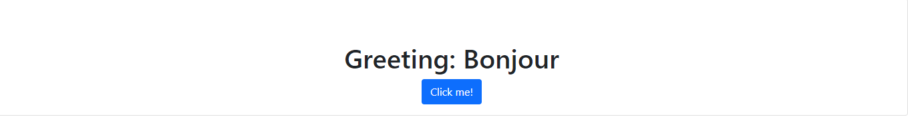
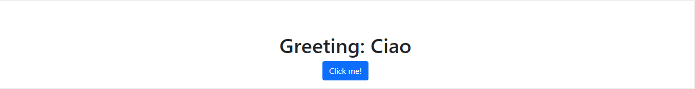

# hello-rails-front-end

- In this project I created a React-redux SPA called 'hello-rails-front-end', where a random greeting is fetched from hello-rails-back-end API and is displayed.


## Built With

- React
- Redux
- Bootstrap
- CSS3
- [hello-rails-back-end](https://github.com/Rocio01/hello-rails-back-end)


## Images
## 
## 

## Getting Started

To get a local copy up and running follow these simple example steps.


### Setup and Install

- Clone this repository using the link above (click on the 'code' button)
- Open a terminal and `cd` to the cloned repository
- run `npm install`

### Usage

Start server with:

```
npm run start
```

- Open `http://localhost:4000/` in your browser.
- Open `http://localhost:4000/greeting` in your browser to see a random greeting.

  
## Rails Backend  API
```https://github.com/Rocio01/hello-rails-back-end```

## Author

## 👩‍💻 Rocio Martinez
- Github: [@Rocio01](https://github.com/Rocio01)
- Twitter: [@rugiada8801](https://twitter.com/rugiada8801)
- Linkedin: [zulma-rocio-martinez](https://www.linkedin.com/in/zulma-rocio-martinez)


## 🤝 Contributing

Contributions, issues and feature requests are welcome!

Feel free to check the [issues page](https://github.com/Rocio01/hello-rails-front-end/issues).

## Show your support

Give a ⭐️ if you like this project!
